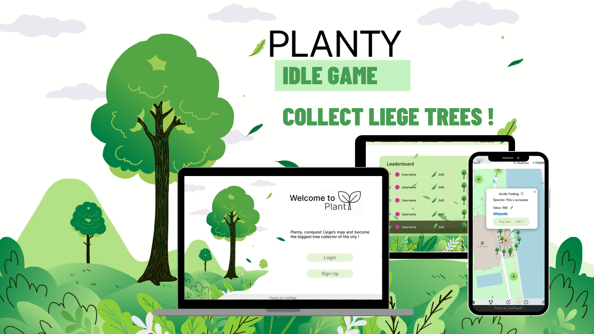
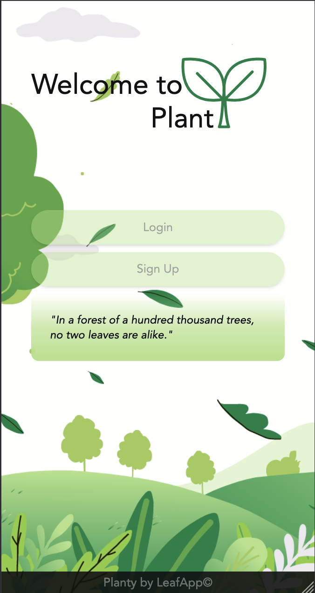
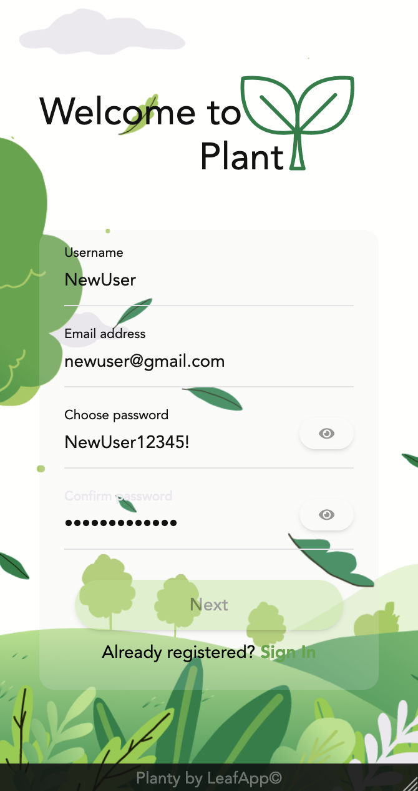
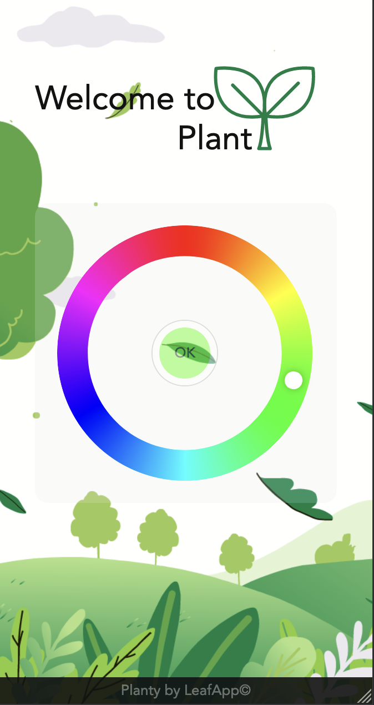
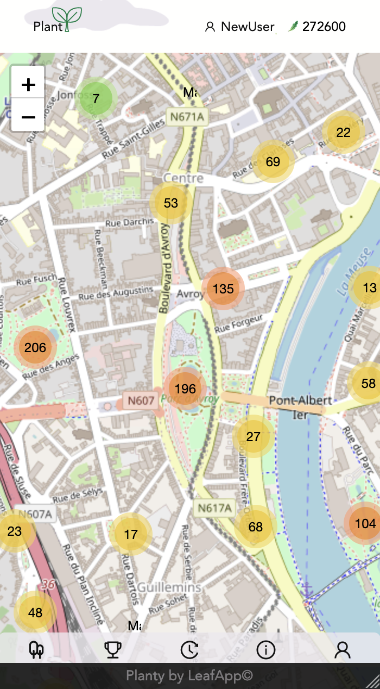
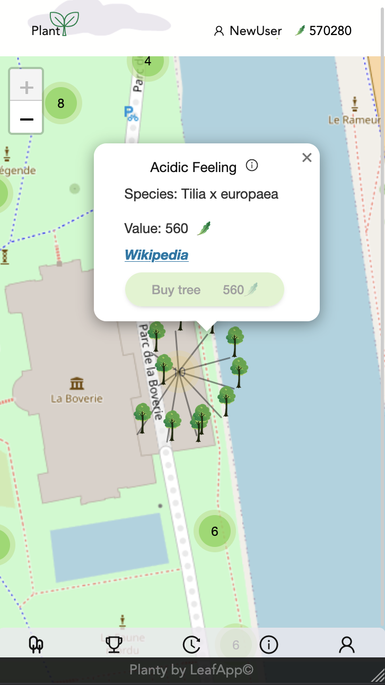
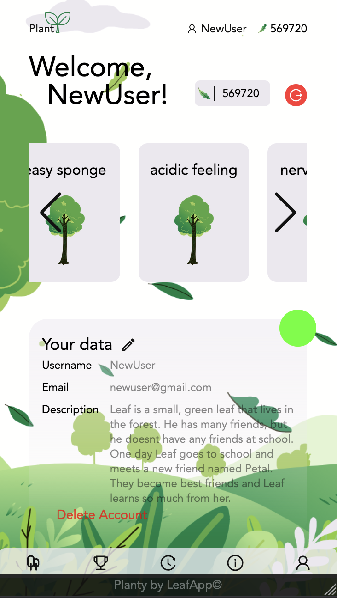
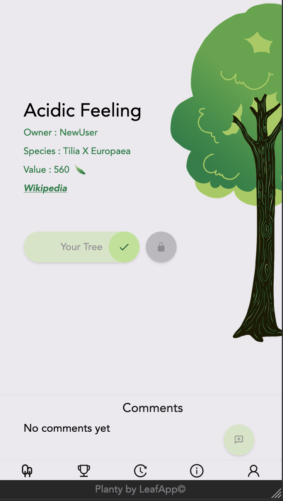

# LeafApp project
<p align="center">
  
</p>
<p align="center">


</p>

_The idea for the project has been elaborate by the BeCode.org training._

## 🌱 Project description
>Planty is a MERN(Mongo, Express, React, Node.js) stack Web Application. It's an IDLE based in Liège/Luik. The purpose is to collect trees existing in the city and become the biggest owner on the map by buying and locking every trees available.
The player receives a wallet with leafs(the game money) at the beginning and this wallet decreases and increase throughout the game. More explanation in the **[walkthrough](#walk)** .  

## Table of content


1. **[Techs used](#tech)**<br>
2. **[Walkthrough of the game](#walk)**<br>
3. **[How to run the project](#run)**<br>
4. **[The Project Team ](#team)**<br>
5. **[Credits](#credits)**<br>

<a name="tech"></a>

## 🚧 Techs and NPM Modules 


#### 🎨 FrontEnd : 

**→** React

**→** Vite


##### NPM Modules and others :

- **axios** (request)
- **leaflet** (map)
- **react-leaflet-cluster** (cluster)
- **lottie-react** (logo)
- **react-icon** (icon)
- **react-router-dom** (route)
- **radial-color-picker** (color picker)
- **swiper** (swipe in user profil)
- **eslint** (to find quickly problems in the code)
- **prettier** (code formatter)
- **tailwindcss** (style)

#### ⛓️ BackEnd : 


**→** Node.js

**→** MongoDB 

##### NPM Modules and framework :
- **bcrypt** (hash the password)
- **cors** (allows restricted source on the webpage)
- **dotenv** (read the .env)
- **jwt-decode** (json token)
- **jsonwebtoken** (json token)
- **mongoose** (connect to MongoDB)
- **morgan** (Error testing logs)
- **node-cron** (Programs specific action)
- **nodemon** (Reloading the server)
- **project-name-generator** (Generate random name)
- **validator** (Check the authentication fields)

<a name="walk"></a>

## 🚶 Walkthrough
<p align="center">

</p>
<p align="center">
  
  
</p>

First, to start off the game the player have an account. To create an account, it requires : 
- an username
- an email account
- a secure password
- an unique hexadecimal color from the color picker(each player has a color in the game).

<p align="center">
  
  
</p>

As the player logs in, he arrives on the map. He can wander around to buy tree and check which tree are available or already owned. He can also check the details of the tree, which we will see as well on the profile below. 

<p align="center">
  
  
</p>

- On his profile, the player can check the trees he possesses, modify his personal info and log out. 
- On the tree detailed pages, you can see its personal name (random at the DB creation), its owner, its species, the actual value, the wikipedia page of its species. You can lock the tree to prevent another player to buy it and sell the tree.
- On the tree page, players can post comments and interact with the community. 

For more precision on the game mechanics here the [Backend repository](https://github.com/krabandicoot/Planty_Backend).

<p align="center">
  
</p>

Finally, you can check the scores status of all the players in the leaderboard, to know it you are a good conqueror. 

<a name="run"></a>


## ⏳ How to run the project

#### Git clone the project ✔️

Run in your terminal :

```git@github.com:krabandicoot/Planty_Becode.git```

#### Run the Frontend part ✔️


Open in a new terminal 

```cd app/client && npm i --force```


Once the depencies are installed run : 

```npm run build && npm run dev``` 

#### Run the Backend part ✔️

Open in a new terminal 

```cd app/server && npm i```

Once the depencies are installed run : 

```npm run start```

To understand how to modify the ```.env```and create your DB of trees [check out this link.](https://github.com/krabandicoot/Planty_Backend#usage) 

#### See the project ✔️

Once the server run, check the locahost your receive with vite on the client terminal to access the webApp.

<a name="team"></a>

## 🤝 Team 

- Jade Muratet | Frontend | [LinkedIn](https://www.linkedin.com/in/jademuratet/) | Frontend |[GitHub](https://github.com/TreshMiralissa)
- Lisa Mazzarisi | Frontend | [LinkedIn](https://www.linkedin.com/in/lisa-mazzarisi/) |[GitHub](https://github.com/lilouMazzarisi)
- Danaé Grosjean | Backend | [LinkedIn](linkedin.com/in/danae-grosjean/) | [GitHub](https://github.com/Da-nae)
- Khadja Paux | Backend | [LinkedIn](https://www.linkedin.com/in/khadja-paux/) | [GitHub](https://github.com/krabandicoot)

<a name="credits"></a>

## 🦾 Credits
Database from [Belgium OpenData Initiative website](https://data.gov.be/en)

The logo was made by [Sheikh Sohel](https://lottiefiles.com/sheikhsohel)

Design comes from [Freepik](https://fr.freepik.com/vecteurs-libre/fond-paysage-automne-plat_5138058.htm#page=3&query=paysage%20automne&position=30&from_view=search&track=ais) and have been modified for our color palette. 

Special thanks to Luna Muylkens |[GitHub](https://github.com/LunashaGit) | For helping us debugging and optimize for the deployment. 